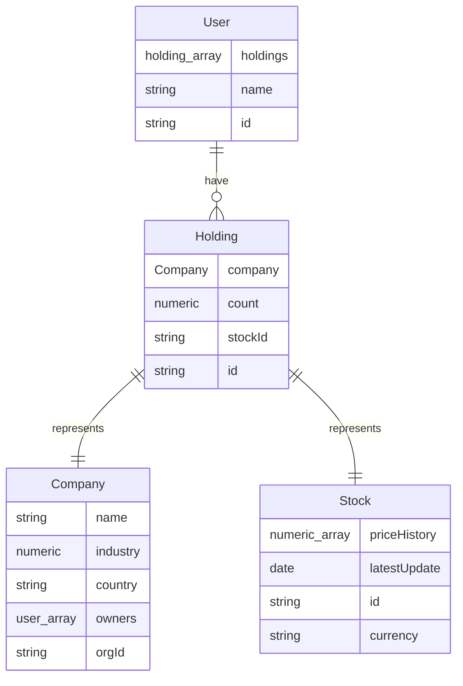

# Fakket

## A basic market

GraphQL interface

## Industry mapping

0 = tech
1 = agriculture
2 = healthcare
3 = 

## Datapoint explanations

### Company

- name : name of the company
- industry : number representing the industry, see [Industry mapping](#industry-mapping)
- country : string containing country ISO-code
- owners : array of owners
- orgId : string containing the organisation number