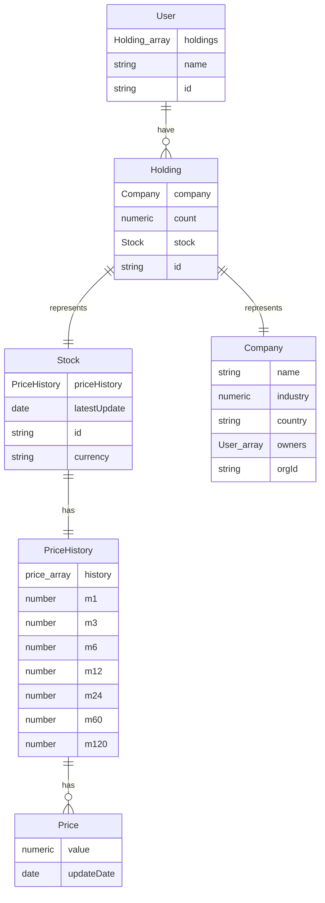
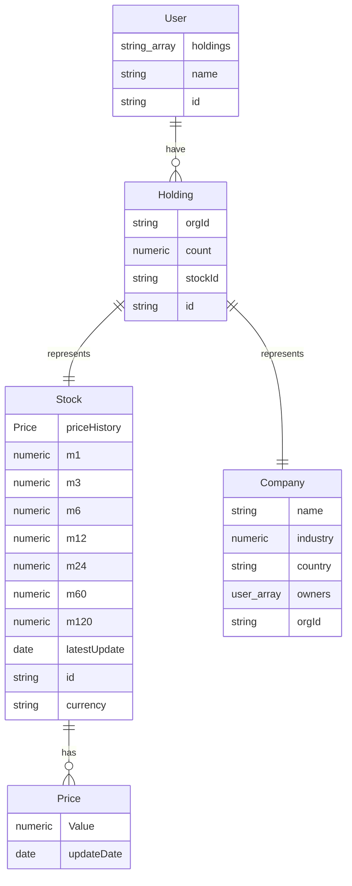

# Fakket

## A basic market

GraphQL interface

PostgreSQL interface

## Mappings

Description of the different names and numbers that represents industries, time periods etc.

### Industry

0 = tech
1 = agriculture
2 = healthcare

### Time periods

m1 = one month back
m3 = one quarter back
m6 = a half year back
m12 = a year back
m24 = two years back
m60 = five years back
m120 = ten years back

## Datapoint explanations

Explanations of the different data points for each query/table

### Company

- name : name of the company
- industry : number representing the industry, see [Industry mapping](#industry-mapping)
- country : string containing country ISO-code
- owners : array of owners
- orgId : string containing the organisation number